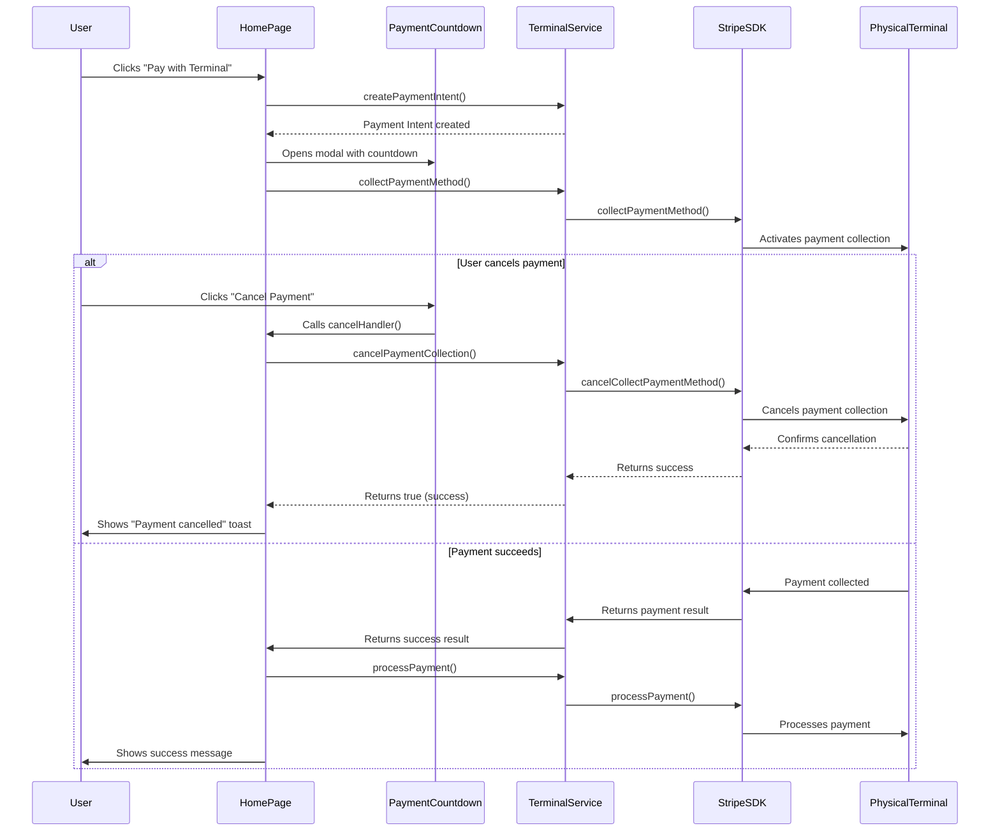

# Payment Cancellation in Stripe Terminal POS

This document provides a detailed analysis of the payment cancellation functionality in the Stripe Terminal POS application, focusing on the code in `src/services/terminal-service.ts:285-287`.

## Code Snippet

```typescript
this.logger.info('Cancelling payment collection...');
await this._terminal.cancelCollectPaymentMethod();
this.logger.info('Payment collection cancelled successfully');
```

## 1. Purpose and Functionality

This code is the core of the `cancelPaymentCollection()` method, which:
- Cancels an in-progress payment collection on a physical Stripe Terminal device
- Logs the beginning and successful completion of the cancellation process
- Communicates with the Stripe Terminal SDK to abort the current payment operation

The method serves two critical purposes:
- Allows users to manually cancel a payment in progress
- Provides an error recovery mechanism when payment collection fails

## 2. Key Components and Their Interactions

The code involves several components working together:

- **Logger System**: Uses the application's logging infrastructure to record operation status
- **Stripe Terminal SDK**: The `_terminal` object is an instance of the Stripe Terminal SDK
- **SDK Method**: `cancelCollectPaymentMethod()` is a method provided by the SDK that sends a command to the physical payment terminal
- **Error Handling**: The full method (lines 278-293) includes validation and error handling

In the broader application flow:
1. When a user clicks "Cancel Payment" in the PaymentCountdown modal
2. The HomePage component calls `terminalService.cancelPaymentCollection()`
3. This method executes our code snippet to cancel the payment on the physical terminal
4. The result is returned to the UI layer, which shows appropriate feedback to the user

## 3. Important Patterns and Techniques

The code demonstrates several important patterns:

- **Asynchronous Programming**: Uses `async/await` for clean handling of asynchronous operations
- **Logging Pattern**: Logs both the start and completion of the operation for monitoring and debugging
- **Promise-based API**: Interacts with the Stripe Terminal SDK's promise-based API
- **Service Layer Pattern**: Encapsulates terminal operations in a dedicated service class
- **Error Handling**: The full method includes try/catch blocks for graceful error handling
- **Boolean Return Value**: Returns a simple boolean to indicate success/failure to calling code

## Full Method Implementation

```typescript
async cancelPaymentCollection(): Promise<boolean> {
  if (!this._terminal) {
    this.logger.warn('Cannot cancel payment collection: Terminal is not initialized');
    return false;
  }
  
  try {
    this.logger.info('Cancelling payment collection...');
    await this._terminal.cancelCollectPaymentMethod();
    this.logger.info('Payment collection cancelled successfully');
    return true;
  } catch (error) {
    this.logger.warn('Error cancelling payment collection', error);
    return false;
  }
}
```

## Payment Flow Diagram



## Related Components

The payment cancellation functionality interacts with several other components:

1. **PaymentCountdown.vue**: Displays the payment UI with a cancel button
2. **HomePage.vue**: Contains the cancelHandler that calls the cancelPaymentCollection method
3. **Logger.ts**: Provides the logging infrastructure used by the method
4. **terminalTypes.ts**: Defines the types and interfaces used in the terminal service

## Conclusion

The payment cancellation functionality is a critical part of the payment flow, providing both a good user experience (allowing users to cancel payments) and system resilience (handling error conditions gracefully). The implementation follows best practices for asynchronous programming, error handling, and service design.